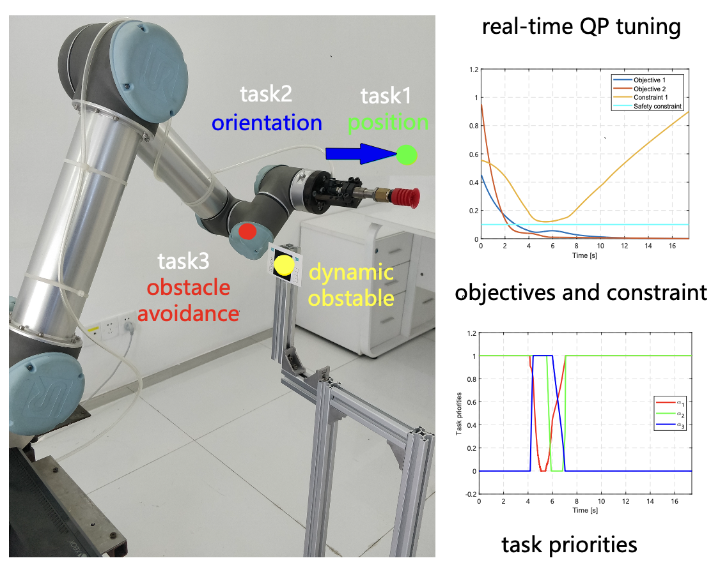

# Real-Time Tuning of Soft Task Priorities with Quadratic Programming

An archival robotics research prototype for adapting competing task objectives online. The method uses constrained quadratic programming to update soft task priorities for a UR5 manipulator operating around changing targets and obstacles.

[](https://www.youtube.com/watch?v=YBgM1MzcjqU)

**[Watch the real-robot demo](https://www.youtube.com/watch?v=YBgM1MzcjqU)**

**Resources:** [Demo video](https://www.youtube.com/watch?v=YBgM1MzcjqU) · [Unpublished technical report](./real_time_task_priority_tuning_technical_report.pdf)

## Overview

A robot often needs to satisfy several objectives simultaneously, such as reaching a target, maintaining its end-effector orientation, avoiding obstacles, and respecting joint constraints. Fixed task weights cannot adapt when these objectives conflict or the environment changes.

This project formulates online task-priority selection as a constrained quadratic program. At each control step, the optimizer updates the task weights from the current robot state, task objectives, and safety constraints, and combines the individual task controllers into one joint command.

## Highlights

- Online adaptation of soft task priorities with quadratic programming
- Position, orientation, and preferred-configuration objectives
- Obstacle-separation and robot-limit constraints
- ROS and MoveIt integration for a UR5 manipulator
- Evaluation in simulation and real-robot experiments

## Repository Structure

```text
online_tuning/
├── include/online_tuning/controller.h  # Controller interface and parameters
├── src/controller.cpp                  # Task controllers and QP formulation
├── src/main_code.cpp                   # ROS control loop
├── launch/load_ur5.launch              # UR5 Gazebo and MoveIt launch file
├── CMakeLists.txt
└── package.xml
```

## How to Cite

The report is unpublished, so please cite it together with this repository:

```bibtex
@techreport{zhu2019realtimetuning,
  author = {Zhu, Yiyao and Li, Jian and Wang, Yuquan and Su, Yinyin and Chen, Yongquan},
  title  = {Real-time Tuning Soft Task Priorities with Quadratic Programming},
  year   = {2019},
  type   = {Unpublished technical report},
  note   = {Available at \url{https://github.com/zyy721/Real-time_tuning}}
}
```
